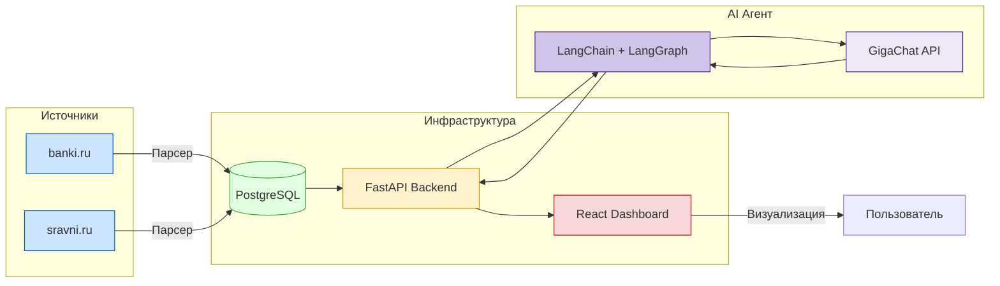

# 📊 Dastats - Сервис аналитики отзывов

[](https://reactjs.org/)
[](https://fastapi.tiangolo.com/)
[](https://postgresql.org/)
[](https://docker.com/)
[](https://developers.sber.ru/portal/products/gigachat)
[](https://python.org/)


[](LICENSE)

## 🚀 О проекте

**Dastats** — современный веб-сервис для анализа отзывов клиентов банковских продуктов. Платформа предоставляет интуитивно понятный дашборд с мощными возможностями визуализации и AI-анализа тональности отзывов.

### ✨ Ключевые возможности

- 📈 **Интерактивная аналитика** — визуализация данных по 25,000+ отзывов
- 🎯 **Категоризация продуктов** — анализ по 12 банковским категориям  
- 🧠 **AI-анализ тональности** — автоматическая классификация настроений
- ⚡ **Реальное время** — мгновенная обработка новых отзывов
- 📊 **Гибкая фильтрация** — настройка временных диапазонов и категорий

### 🎯 Источники данных

- [**banki.ru**](https://www.banki.ru) — ведущий финансовый портал России
- [**sravni.ru**](https://www.sravni.ru) — сервис сравнения банковских продуктов
- Просматривать динамику отзывов по 12 категориям продуктов:
  - Дебетовые карты
  - Кредитные карты
  - Ипотека
  - Автокредиты
  - Реструктуризация
  - Кредиты
  - Депозиты
  - Переводы
  - Мобильное приложение
  - Индивидуальное обслуживание
  - Удаленное обслуживание
  - Другое
- Для каждой категории отображается **тональность отзывов**: позитивная, нейтральная, негативная.
- Доступ к LLM для классификации новых отзывов.

Фронтенд написан на **React**, бэкенд на **Python (FastAPI)**, база данных — **PostgreSQL с использованием SQLAlchemy + asyncpg**. В систему загружено **25 000 исторических отзывов**, предварительно спаршенных с источников.

Ссылка на дашборд: https://forthang.github.io/misis-lct_sat/

Endpoint для predict доступен по https://lct.misis-team.ru:8000/api/predict

---

## ⚙️ Архитектура



---

## 🧠 Используемые методы

- **Классификация категорий отзывов**: AI-агент на базе **LangChain + LangGraph**, модель **GigaChat** от Сбера.
- **Классификация тональностей**: тот же агент с отдельным промптом.
- **Метрики качества**:
  - *F1-micro* для классификации категорий.
  - *Accuracy* для классификации тональностей.

---

## 📑 Интерфейс сервиса
На странице дашборда доступно:
- Фильтрация по категориям продуктов.
- Настройка временного диапазона (всё время, месяц, полгода, год, произвольные даты).
- График статистики по количеству отзывов.
- Диаграмма тональностей для выбранных категорий.

---

## 📦 Запуск проекта

### Требования
- Установленный **Docker** и **Docker Compose**
- Для успешного запуска нужно получить ключ доступа от GigaChat и поместить его в .env

### Команды запуска
```bash
git clone <репозиторий>
cd <директория проекта>
docker compose up
```

Веб-сервис будет запущен по адресу 
```
http://localhost:5173
```

API endpointa для predict лежит на 
```
http://localhost:5173/api/predict
```

---

## 📂 Исторические данные
- Собрано и сохранено **25 000 отзывов**.
- Парсинг выполнялся с помощью кастомного скрипта на Python (requests + json + html очистка).
- Данные хранятся в PostgreSQL и обновляются при добавлении новых отзывов.

---

## ✅ Стек технологий
- **Backend**: Python, FastAPI, LangChain, LangGraph
- **Frontend**: React
- **Design**: Figma
- **Database**: PostgreSQL (SQLAlchemy + asyncpg)
- **ML/LLM**: GigaChat API от Сбера
- **Инфраструктура**: Docker, Docker Compose

---

## 🚀 Возможные улучшения
- Добавить автоматическую выгрузку новых отзывов по расписанию.
- Расширить метрики качества (Precision, Recall).
- Внедрить user-friendly экспорт отчётов в Excel/PDF.
